### Credit_Risk_Analysis

## Overview:
The purpuse of this project was to use Python under the concept of supervised machine learning to construct and evaluate several machine learning models to predict credit risk.

The models adopted within the project includes:

1. Random Over Sampler
2. SMOTE algorithms
3. Cluster Centroids algorithm
4. SMOTEENN algorithm
5. Balanced Random Forest Classifier 
6. Easy Ensemble Classifier 

Tools used were Python, imbalanced-learn library, scikit-learn library and jupyter notebook. The dataset analyzed was `LoanStats_2019Q1.csv`.

## Results: 
* Random Over Sampler

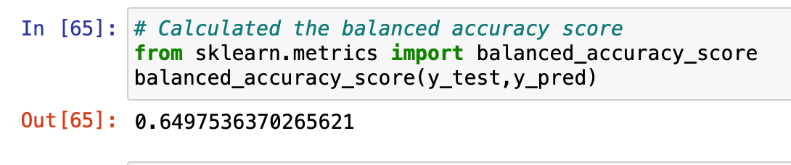

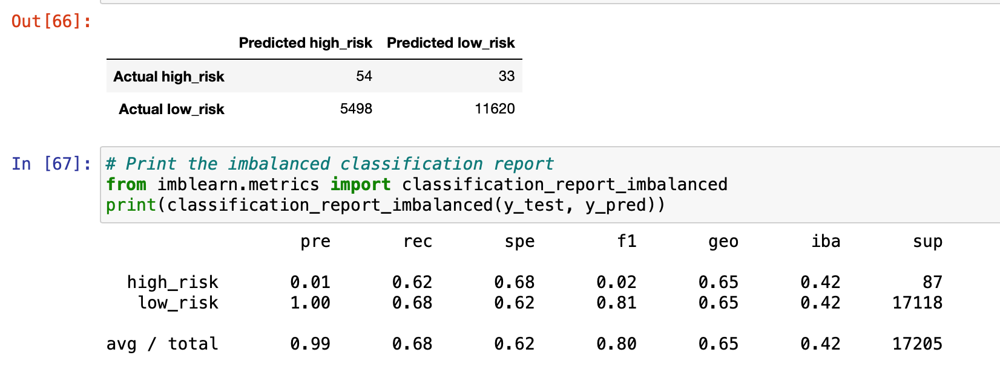

It can be observed that this model had a balanced accuracy score of approximately 65%.The high_risk loan precision was about 1% and 100% for low_risk loans. Recalls for high_risk loans was 62% and 68% for low risk_loans.

* SMOTE algorithms

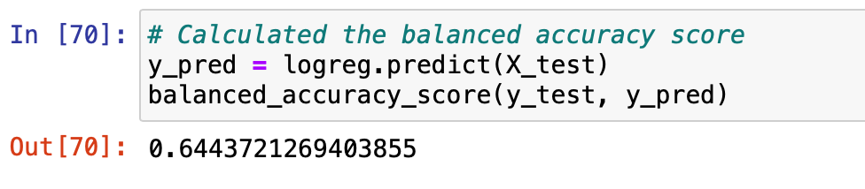

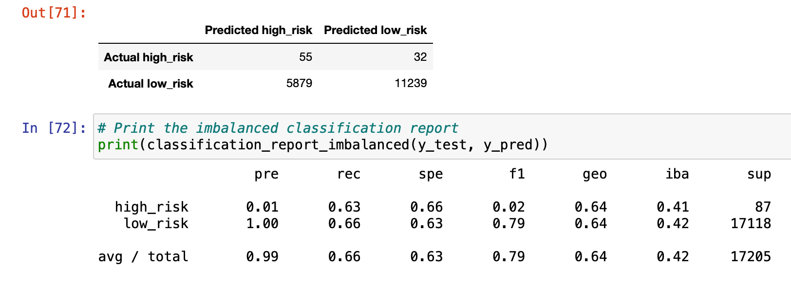

It can be observed that this model had a balanced accuracy score of approximately 64%.The high_risk loan precision was about 3% and 100% for low_risk loans. Recalls for high_risk loans was 70% and 87% for low_risk loans.

* Cluster Centroids algorithm

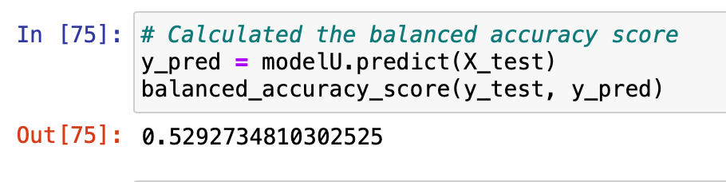

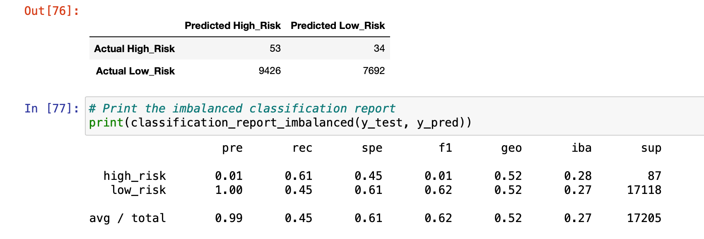

It can be observed that this model had a balanced accuracy score of approximately 53%.The high_risk loan precision was about 1% and 100% for low_risk loans. Recalls for high_risk loans was 61% and 45% for low_risk loans.

* SMOTEENN algorithm

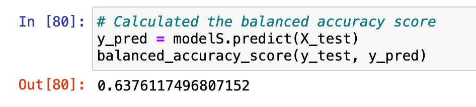

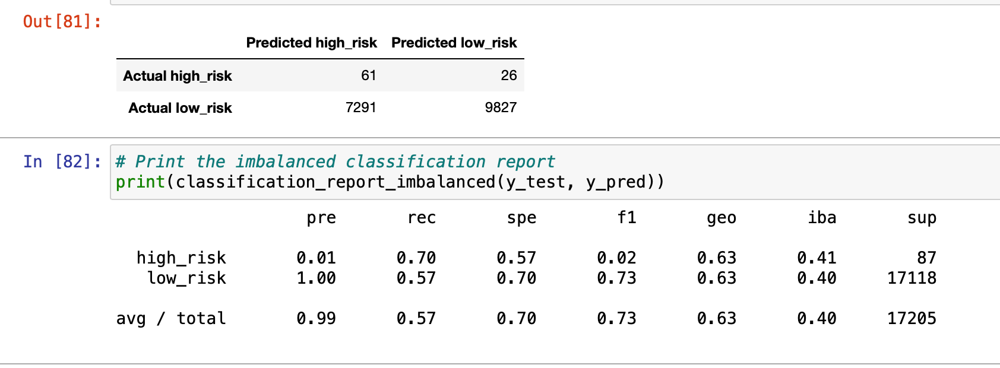

It can be observed that this model had a balanced accuracy score of approximately 64%.The high_risk loan precision was about 1% and 100% for low_risk loans. Recalls for high_risk loans was 70% and 57% for low_risk loans.

* Balanced Random Forest Classifier 

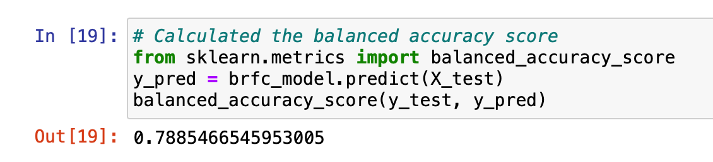

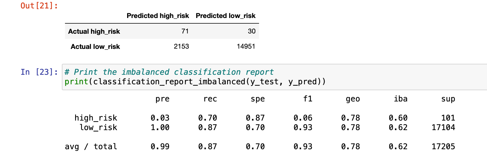

It can be observed that this model had a balanced accuracy score of approximately 78%.The high_risk loan precision was about 3% and 100% for low_risk loans. Recalls for high_risk loans was 70% and 87% for low_risk loans.

* Easy Ensemble Classifier

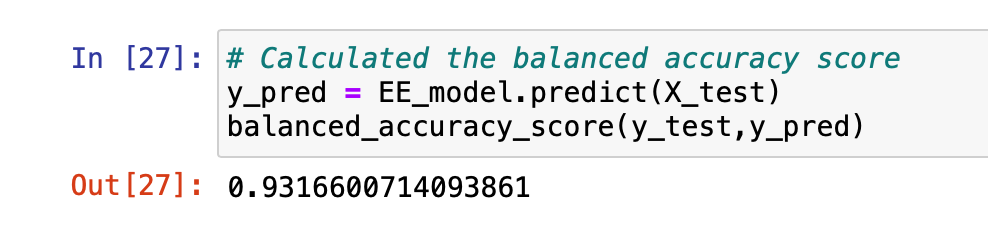

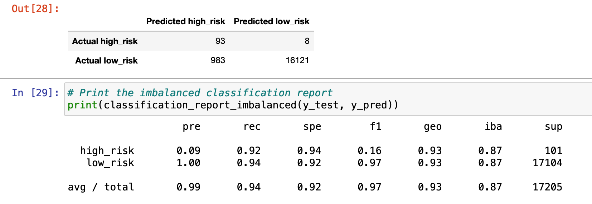

It can be observed that this model had a balanced accuracy score of approximately 93%.The high_risk loan precision was about 9% and 100% for low_risk loans. Recalls for high_risk loans was 92% and 94% for low_risk loans.

## Summary: 
Based on the results from all six machine learning models, one can conclude that the Easy Ensemble Classifier modely yielded the best results with the highest balanced accuracy score of approximately 93% coupled with high precision and sensitivity rates. One must note that the original dataset had approximately 99% of its loan applicants classified as low-risk with the remaining 1% as high-risk. Since the data is heavily skewed, one can suspect machine learning predictions to be skewed as well.

